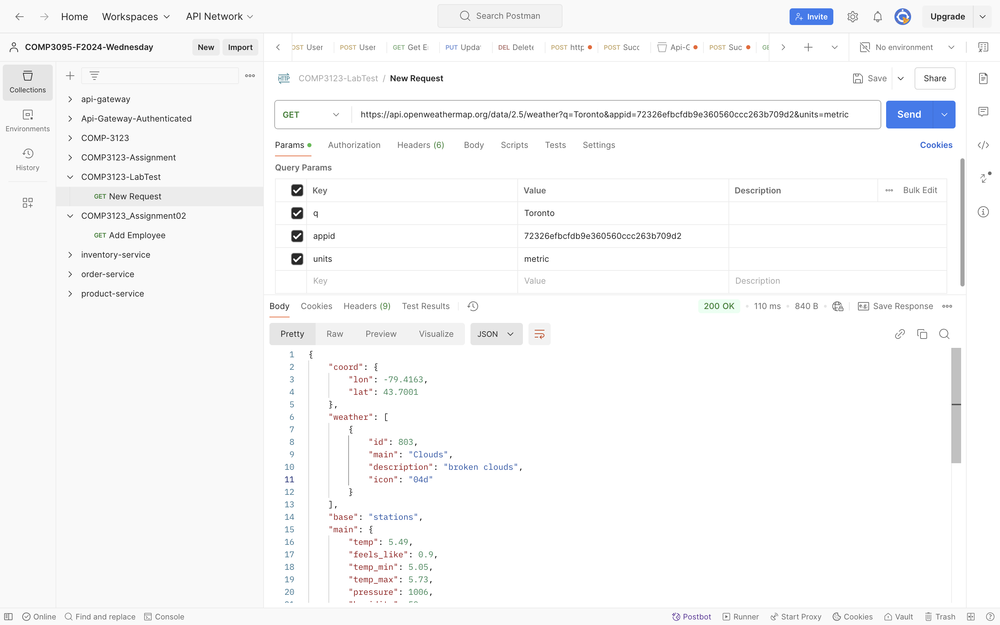
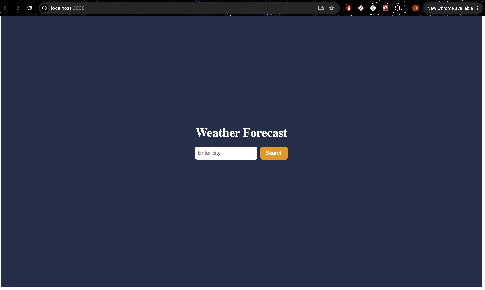
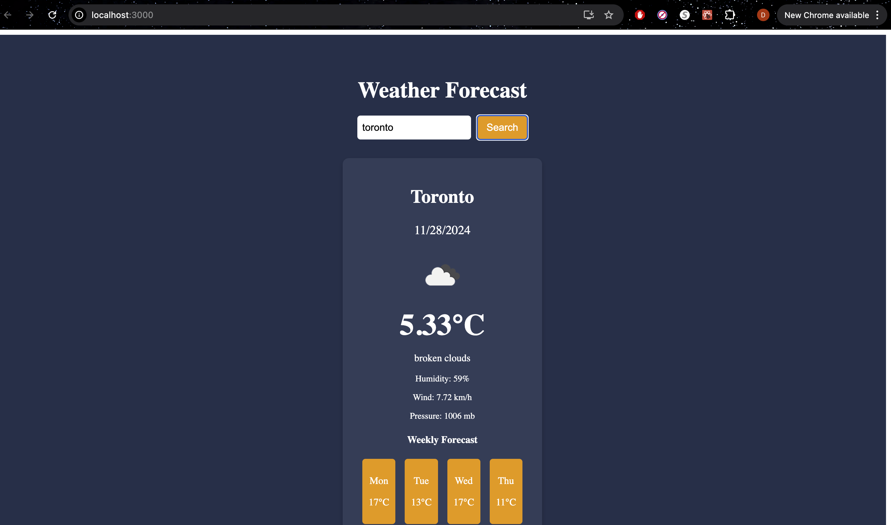

# Description
 This is a simple weather application built with React that allows users to check the current weather conditions for any city.
 
1. **Screenshots**: 
   - 
   - 
   - 

2. **API Key**: 
   - API_KEY = "72326efbcfdb9e360560ccc263b709d2";

3. **Name**:
   - Name : Drasti Parikh
   - Student Id : 101419828